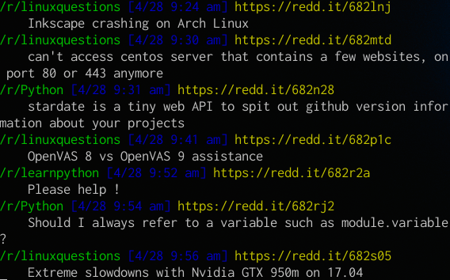

# RedditWatcher

Listens to a stream of reddit submissions



## Installation

 1. `git clone https://github.com/tstringer/redditwatcher.git`
 2. `cd redditwatcher`
 3. `./install`

:bulb: You must [register a reddit app](https://www.reddit.com/prefs/apps/) and then define `REDDITWATCHER_CLIENTID` and `REDDITWATCHER_CLIENTSECRET` environment variables to their appropriate values

## Usage

RedditWatcher takes a list of unnamed arguments that are the subreddits you want to stream

```
redditwatcher python javascript learnpython
```
